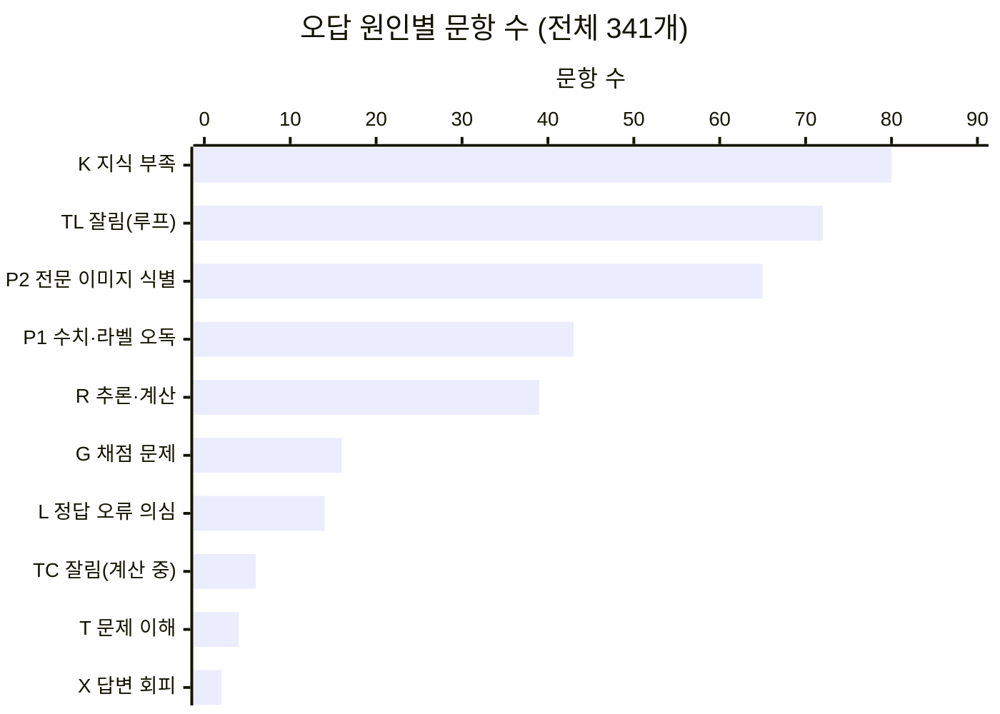
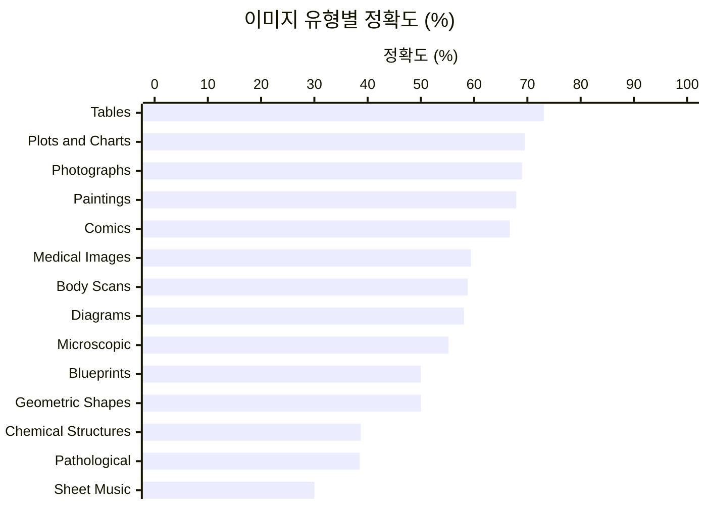
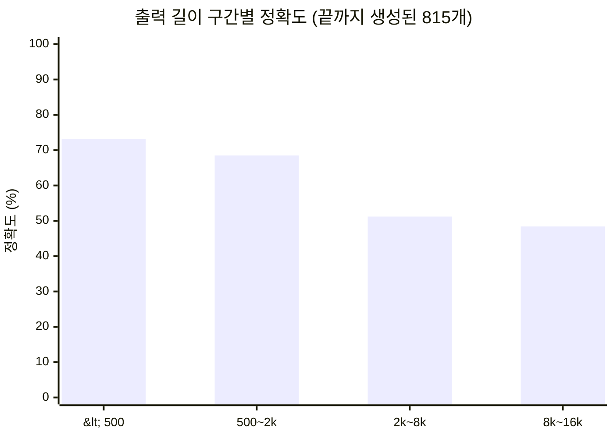

# MMMU-val 평가 결과 분석 — Qwen3-VL-4B-Instruct (09-23 실행)

- **대상**: `outputs/qwen3vl4b_mmmu_val/` (보고 점수 실행, `max_new_tokens` 16384, seed 3407)
- **채점 기준**: Qwen 파서 + 최종 답 추출(`scores_qwen.csv`), judge·무작위 선택 없음 → **62.11점 (559/900), 오답 341개**
- **참고 실행**: `outputs/qwen3vl4b_mmmu_val_rerun/` (같은 설정 재실행), `outputs/qwen3vl4b_mmmu_val_32k/` (32768 토큰)
- **작성일**: 2026-09-27
- 파이프라인 설정과 격차 요약은 [`mmmu_baseline.md`](mmmu_baseline.md) 참고. 이 문서는 그 근거가 되는 문항 단위 분석입니다.

## 분석 방법

| 단계 | 방법 |
|---|---|
| 잘림 | `finish_reason == "length"` (16384 토큰 도달) |
| 반복 루프 | 응답 마지막 1만 자의 zlib 압축률 < 0.10 **또는** 마지막 1만 자의 줄(15자 이상) 중 80% 이상이 응답 안에서 그대로 반복된 줄 |
| 파싱 검증 | 객관식: 응답 끝 600자에서 모델이 마지막으로 고른 보기와 파싱 결과를 자동 대조하고, 어긋난 것은 직접 읽음. 주관식: 전부 직접 읽음 |
| 오답 원인 | 잘림·채점 문제는 규칙으로 분류하고, 나머지 247개는 문제·보기·정답·응답을 읽고 분류. 이미지 판독이 원인일 수 있는 문항은 이미지를 직접 열어 모델의 이미지 묘사와 대조 |
| 원 데이터 | HF `MMMU/MMMU` @98e6ac0c validation (이미지, `topic_difficulty`, `img_type`, `subfield` 메타데이터) |

오답 원인 분류는 [MMMU 논문](https://arxiv.org/abs/2311.16502)의 GPT-4V 오답 분석 범주(지각 오류, 지식 부족, 추론 오류, 문제 이해, 답변 거부, 레이블 오류)를 기본으로 하고, 이 파이프라인에서 생기는 잘림·채점 범주를 더했습니다.

---

## 1. 끝까지 생성됐는데 파싱에 실패한 38개

**정의**: 16384 토큰 안에 응답이 끝났는데, **최종 답 추출 → Qwen 파서(`can_infer`)까지 모두 거친 뒤에도 답을 찾지 못한 경우**입니다. Qwen 파서 실패 96개 = 끝까지 생성 38 + 잘림 58.

주관식은 보기가 없어서 공식 방식대로 `{A: 정답, B: "Other Answers"}` 2지선다로 바꿔 판정합니다. 그래서 주관식의 "파싱 실패"는 **응답에 정답 문자열이 들어 있지 않다**는 뜻이고, 실제 오답과 표기만 다른 정답이 함께 섞여 있습니다.

### 1.1 주관식 32개

| 문제 | 정답 | 모델 답 (추출 결과) | 판정 |
|---|---|---|---|
| Biology_10 | 1/64 | `\dfrac{1}{64}` | 표기 차이 (값 같음) |
| Electronics_2 | 2.83 | `2\sqrt{2}` (=2.828) | 표기 차이 |
| Electronics_27 | -120 | 240 | 표기 차이 (같은 각도) |
| Finance_17 | 1000 | 1,000 | 표기 차이 (쉼표) |
| Finance_20 | 7243000 | 7,243,000 | 표기 차이 (쉼표) |
| Finance_30 | 1249 | 1,249.24 | 표기 차이 (쉼표, 정답이 반올림값) |
| Manage_20 | 2960 | 2,960 unfavorable | 표기 차이 (쉼표+단어) |
| Math_15 | ['24/7', '3.429'] | `\frac{24}{7}` | 표기 차이 (목록형 정답은 문자열 그대로 비교돼 원래 맞을 수 없음) |
| Electronics_25 | 50 | "Given the ambiguity … rating for the diode is:" | **추출 실패** (답 `50V`가 `Answer:` 다음 줄에 있음) |
| Chemistry_13 | 12.97 | 13.0 g | 반올림 애매 (13.006을 유효숫자 3자리로) |
| Chemistry_25 | 24.32 | 24.3 | 반올림 애매 (모델 값이 덜 정밀) |
| Finance_23 | 527.89 | 527.74 million | 반올림 애매 (0.03% 차이) |
| Manage_3 | 242110.62 | 242,159.73 | 반올림 애매 (0.02% 차이) |
| Geography_4 | ['Tampa', 'Florida'] | Clearwater, Florida | 부분 정답 (주만 맞음) |
| Chemistry_4 | trans-1-Chloro-4-methylcyclohexane | cis-1-chloro-2-methylcyclohexane | 오답 |
| Chemistry_20 | 5 | 3 | 오답 |
| Chemistry_23 | 6.5 | 0.0246 | 오답 (풀이 없이 숫자만 출력) |
| Chemistry_30 | MgS | MgO | 오답 |
| Computer_Science_26 | 251 | 156 | 오답 (풀이 없이 숫자만 출력) |
| Electronics_4 | 8.4 | `V_{CEQ} \approx 7.0 V` | 오답 |
| Electronics_5 | 62.6 | 50 Ω | 오답 |
| Electronics_16 | 20 | `\frac{100}{3}` | 오답 |
| Electronics_21 | 0.9965 | 0 | 오답 |
| Electronics_24 | 551 | 580 kΩ | 오답 |
| Electronics_26 | 6.333 | 11 | 오답 |
| Electronics_29 | 30 | 28.8 | 오답 |
| Electronics_30 | -141 | 45.84 | 오답 |
| Finance_8 | 360 | 860 | 오답 |
| Finance_10 | 2000000 | 1,646,100 | 오답 |
| Finance_24 | 30.0 | 20 | 오답 |
| Geography_14 | 8200 | 2240 | 오답 |
| Physics_21 | A | D | 오답 (보기 글자형 정답인 주관식) |

### 1.2 객관식 6개

| 문제 | 정답 | 추출 결과 | 모델의 실제 최종 선택 | 판정 |
|---|---|---|---|---|
| Math_24 | A | `r = \frac{2R}{3}` (LaTeX 수식) | **A** (`Correct Option: **A**`) | **추출 실패로 정답을 놓침** |
| Agriculture_12 | A | "None of the above …" | 없음 | 답변 거부 |
| Agriculture_23 | D | 응답 전체 (표시 없음) | B | 오답 (추출 성공해도 오답) |
| Chemistry_26 | C | "set (b)." | B | 오답 |
| Diagnostics_and_Laboratory_Medicine_14 | A | 응답 전체 (표시 없음) | B | 오답 |
| Manage_6 | D | "The question contains an error …" | B | 오답 |

### 1.3 정리

| 판정 | 개수 |
|---|---|
| 값이 맞는데 채점에서 틀림 (표기 차이 8 + 추출 실패 2) | 10 |
| 애매 (반올림 4 + 부분 정답 1) | 5 |
| 답변 거부 | 1 |
| 실제 오답 (주관식 18 + 객관식 4) | 22 |
| **합계** | **38** |

- `mmmu_baseline.md` 7절의 "규칙 실패 38개(최대 +4.2점)"는 이 38개입니다. 실제로 구제할 수 있는 건 **값이 맞는 10개(+1.1점), 애매한 것까지 15개(+1.7점)** 이고, 나머지 22개는 judge를 써도 오답입니다.
- 주관식은 53문제 중 38개가 오답(정확도 28.3%)이고, 그중 15개가 채점 방식(표기 차이·추출·반올림·부분 정답) 문제입니다. **주관식 점수는 채점 규칙에 크게 좌우됩니다.**
- Judge를 사용했다면 개선 가능한 문제수 : 10개 (애매한 문제까지 포함하면 15개) (+1.7%) 

---

## 2. 파싱 정확도: 파싱 결과가 모델의 실제 답과 일치하는가

### 2.1 오답 341개

| 구분 | 개수 | 파싱 결과 = 모델의 실제 최종 답? |
|---|---|---|
| 객관식, 끝까지 생성, 파서가 보기 추출 | 223 | **223/223 일치** (208개 자동 대조 + 15개 직접 확인) |
| 객관식, 끝까지 생성, 파서 실패 | 6 | 모델이 답을 냈는데 못 가져온 것 5개. 그중 **정답을 놓친 것은 Math_24 1개**, 나머지 4개는 모델이 고른 보기도 오답 |
| 주관식, 끝까지 생성, 파서 실패 | 32 | 1.1절 표. 값은 맞는 10개, 애매 5개 |
| 주관식, 끝까지 생성, 파서가 판정 | 2 | Pharmacy_26은 정상 오답. **Basic_Medical_Science_10은 채점기 결함**: 모델 답 `c`가 맞는데, 정답이 글자 하나(`C`)인 주관식이라 `{A: 'C', B: …}`로 바뀐 뒤 A≠C로 판정돼 어떤 답을 내도 맞을 수 없음 |
| 잘림 | 78 | 58개는 파서 실패, 20개는 루프 속 문장의 보기 글자가 추출됨. 모두 모델이 최종 답을 낸 것이 아님 |

### 2.2 반대 방향: 정답 처리됐지만 실제로는 틀린 경우 (정답 559개 점검)

| 경우 | 개수 | 내용 |
|---|---|---|
| 잘린 응답이 우연히 정답 | 7 | 루프 도중 문장의 보기 글자·값이 정답과 일치 |
| 부분 문자열 오탐 | 1 | Basic_Medical_Science_14: 모델 답은 "재조합 DNA 기술"인데, 추출 표시가 없어 응답 전체가 파서로 가고 풀이 속 "transformation"에 걸림 |
| 애매 | 1 | Electronics_12: 모델 답 10.41이 정답 `10`을 문자열로 포함해 정답 처리 (4% 차이) |

### 2.3 결론

- **객관식은 파싱이 모델의 최종 선택을 거의 완벽히 반영합니다.** 끝까지 생성된 객관식 오답 229개 중 파싱 때문에 정답을 잃은 것은 1개뿐입니다. 객관식 오답은 곧 모델의 오답입니다.
- **주관식은 부분 문자열 비교라 양쪽으로 틀립니다.** 표기 차이로 놓치는 것(8개)과 부분 문자열로 잘못 맞히는 것(2개)이 모두 있습니다.
- **채점 오류의 순효과는 작습니다.** 과소평가(값이 맞는데 틀림) 최대 11개 = +1.2점, 과대평가(잘림 행운 7 + 오탐 1~2) 약 8~9개 = −0.9~−1.0점입니다. 두 방향이 거의 상쇄되어 **62.11은 모델 실력에 대한 편향 없는 추정치**로 볼 수 있습니다.

---

## 3. 과목별 순위와 오답·잘림·반복의 관계

### 3.1 오답이 많은 과목 (과목당 30문제)

| 순위 | 과목 | 오답 | 잘림 | 끝까지 생성된 문제의 정확도 |
|---|---|---|---|---|
| 1 | Diagnostics_and_Laboratory_Medicine | 21 | 0 | 30.0% |
| 1 | Music | 21 | 11 | 42.1% |
| 3 | Chemistry | 20 | 1 | 34.5% |
| 4 | Geography | 17 | 2 | 46.4% |
| 4 | Mechanical_Engineering | 17 | 13 | 76.5% |
| 6 | Architecture_and_Engineering | 16 | 12 | 72.2% |
| 6 | Electronics | 16 | 5 | 56.0% |
| 8 | Biology | 15 | 2 | 53.6% |
| 9 | Agriculture | 14 | 0 | 53.3% |
| 9 | Materials | 14 | 11 | 84.2% |
| … | (적은 쪽) Public_Health 3, Art_Theory 4, Literature 5, Marketing 5 | | | |

### 3.2 잘림이 많은 과목

| 순위 | 과목 | 잘림 (09-23) | 잘림 (3회 합) |
|---|---|---|---|
| 1 | Mechanical_Engineering | 13 | 35 |
| 2 | Architecture_and_Engineering | 12 | 34 |
| 2 | Energy_and_Power | 12 | 37 |
| 4 | Materials | 11 | 30 |
| 4 | Music | 11 | 36 |
| 6 | Accounting | 5 | 17 |
| 6 | Electronics | 5 | 12 |
| 8 | Art, Finance | 3 | 10, 11 |
| — | 잘림 0인 과목 14개 | | |

### 3.3 반복 루프가 많은 과목

| 순위 | 과목 | 루프 (09-23) | 루프 (3회 합) |
|---|---|---|---|
| 1 | Architecture_and_Engineering | 12 | 32 |
| 1 | Mechanical_Engineering | 12 | 34 |
| 3 | Energy_and_Power | 11 | 36 |
| 3 | Materials | 11 | 29 |
| 3 | Music | 11 | 36 |
| 6 | Accounting | 5 | 16 |
| 7 | Art, Finance | 3 | 10, 11 |
| 9 | Geography | 3 | 4 |
| 10 | Biology, Electronics, Pharmacy | 2 | 3, 8, 7 |

- 09-23 실행의 루프 80개 중 **78개가 잘림**이고, 잘린 85개 중 **78개가 루프**입니다. 끝까지 생성된 응답에서 루프가 잡힌 것은 2개뿐입니다. 즉 **이 모델에서 잘림과 반복은 사실상 같은 현상**입니다.
- 잘림 7개 중 루프가 아닌 것(Electronics 3개 등)은 새 계산을 이어가다 한도에 닿은 경우입니다.

### 3.4 상관관계

**문제 단위**
| | Easy (295) | Medium (424) | Hard (181) |
|---|---|---|---|
| 정확도 | 70.2% | 62.7% | 47.5% |
| 잘림 비율 | 6.1% | 7.5% | **19.3%** |
| 끝까지 생성된 문제의 정확도 | 74.0% | 66.8% | 58.2% |

**해석**

1. **점수가 낮은 과목은 두 종류입니다.**
   - **잘림형**: <mark>기계·건축·에너지·재료(·음악). 끝까지 답한 문제의 정확도는 72~84%로 평균 이상인데, 문제의 1/3 이상이 루프로 잘려 점수가 떨어집니다. 모두 긴 수치 계산이 필요한 공학 과목입니다.</mark>
   - **인식·지식형**: <mark>진단의학·화학·지리·농학·생물. 잘림은 거의 없는데 끝까지 답한 문제의 정확도 자체가 30~54%로 낮습니다.</mark>
2. 오답과 잘림의 상관(ρ=0.48)은 잘린 문제가 오답으로 들어가서 생긴 것이고, **끝까지 답한 문제의 오답률과 잘림은 무관합니다** (ρ=−0.28, 유의하지 않음). 잘림형 과목의 모델 풀이 능력은 오히려 좋습니다.
3. 잘림은 문제 난이도와 연결됩니다(Hard 19.3% vs Easy 6.1%). 다만 같은 문제도 실행마다 루프 여부가 달라져서(3.5절) 난이도만으로 설명되지는 않습니다.

### 3.5 같은 문제를 다시 돌리면: 루프는 줄지 않고 옮겨 간다

09-23 실행과 같은 설정 재실행(09-26, `outputs/qwen3vl4b_mmmu_val_rerun/`)을 문제별로 짝지어, 두 실행의 잘림 여부로 900문제를 네 그룹으로 나눴습니다.

| 그룹 | 09-23 | 재실행 | 문제 수 | 09-23 정답 | 재실행 정답 | 변화 |
|---|---|---|---|---|---|---|
| A | 잘림 | 끝까지 답함 | 39 | 5 | 22 | **+17** |
| B | 잘림 | 또 잘림 | 46 | 2 | 4 | +2 |
| C | 끝까지 답함 | **새로 잘림** | 32 | 15 | 6 | **−9** |
| D | 끝까지 답함 | 끝까지 답함 | 783 | 537 | 540 | +3 (틀림→맞음 30, 맞음→틀림 27) |
| **합계** | | | **900** | **559 (62.11)** | **572 (63.56)** | **+13** |

- <mark>**잘렸던 문제도 루프를 피하면 절반 이상 맞힙니다.** 09-23에 잘린 85개 중 39개(A)는 재실행에서 끝까지 답했고, 그중 22개(56.4%)가 정답이었습니다.</mark> 두 실행 모두 끝까지 답한 문제(D)의 재실행 정확도 69.0%(540/783)보다는 낮아서 **평균보다 어려운 문제**이지만, 모델이 풀 수 없는 문제는 아닙니다. 잘림은 풀 줄 몰라서 길어졌다기보다 **루프가 답을 막은 경우가 많습니다**.
- **Sampling 노이즈가 존재. 돌릴 때 마다 정확도 차이가 발생 가능(62.11->63.56) +1.45%**
- **그런데 재실행해도 점수는 거의 그대로입니다.** A에서 +17문제를 얻었지만, 09-23엔 끝까지 답했던 32문제(C)가 새로 루프에 빠져 −9문제를 잃었습니다. D에서도 새로 맞은 30개와 새로 틀린 27개가 거의 상쇄됩니다. 합계는 +13문제(+1.45점)이고, 잘림 수도 85 → 78로 비슷합니다.
- **루프는 매 실행 비슷한 비율(약 9%)로 생기지만, 걸리는 문제가 실행마다 바뀝니다.** 두 실행 모두 잘린 문제는 46개뿐이고, 한쪽에서만 잘린 문제가 71개(A 39 + C 32)입니다. 따라서 다시 돌리거나 여러 번 돌려 고르는 방식으로는 루프 손실을 없앨 수 없고, **루프 자체를 억제해야** 점수가 오릅니다.

---

## 4. 오답 원인 분류 (341개)

### 4.1 분류 기준과 결과

| 코드 | 원인 | 기준 | 개수 | 비율 |
|---|---|---|---|---|
| K | 지식 부족 | 이미지는 맞게 읽었지만 도메인 지식·개념이 틀림 | 80 | 23.5% |
| TL | 잘림: 반복 루프 | 16384 토큰에서 끊겼고 루프 판정 | 72 | 21.1% |
| P2 | 지각 오류: 전문 이미지 식별 | 병리·의료 영상, 작품, 악보, 식물 병해 사진 등 전문 이미지를 잘못 식별·판독 | 65 | 19.1% |
| P1 | 지각 오류: 수치·라벨·구조 오독 | 표·그래프 수치, 라벨 대응, 구조식·회로·그래프 연결 관계를 잘못 읽음 | 43 | 12.6% |
| R | 추론·계산 오류 | 이미지와 지식은 맞는데 계산 실수, 잘못된 풀이, 보기와 안 맞자 근거 없이 찍기 | 39 | 11.4% |
| G | 채점 문제 | 표기 차이 8, 추출 실패 2, 채점기 결함 1, 반올림 애매 4, 부분 정답 1 | 16 | 4.7% |
| L | 문제·정답 오류 의심 | 정답 표기가 틀렸거나, 풀이에 필요한 정보가 문제에 없거나, 이미지와 질문이 맞지 않음 | 14 | 4.1% |
| TC | 잘림: 계산 중 | 잘렸지만 루프가 아니라 계산을 이어가던 중 | 6 | 1.8% |
| T | 문제 이해 오류 | 질문이 요구하는 것을 다르게 해석 | 4 | 1.2% |
| X | 답변 회피 | 답을 거부하거나 문제 오류를 주장하고 근거 없이 선택 | 2 | 0.6% |
| | **합계** | | **341** | |

**세 묶음으로 보면**

| 묶음 | 원인 | 개수 | 비율 | 점수 영향 |
|---|---|---|---|---|
| 파이프라인 요인 | 잘림 78 + 채점 16 | 94 | 27.6% | 최대 10.4점 |
| 모델 능력 | P1 + P2 + K + R + T + X | 233 | 68.3% | 25.9점 |
| 데이터 요인 | L | 14 | 4.1% | 1.6점 |

- 모델 능력 오답 233개 안에서는 **지각 오류 46% (P1+P2 108개), 지식 부족 34%, 추론·계산 17%** 입니다. MMMU 논문의 GPT-4V 오답 분석(지각 35%, 지식 29%, 추론 26%)과 비교하면, 4B 모델은 **이미지 판독 비중이 더 높고 추론 비중이 더 낮습니다**.
- <mark>지각 오류 108개 중 65개가 전문 이미지 식별(P2)입니다. 표·그래프 같은 일반 이미지보다 **도메인 이미지(병리 슬라이드, 심전도, 악보, 미술 작품)를 알아보는 능력**이 가장 약합니다.</mark>

### 4.2 원인별 대표 사례

| 원인 | 문제 | 내용 |
|---|---|---|
| K | Chemistry_30 | M²⁺X²⁻의 X를 산소로 가정했으나 산소는 2주기 원소 (정답 MgS) |
| K | Computer_Science_25 | 이상치 1개 때문에 2차 곡선 경계를 선택. 과적합을 피하는 선형 경계 개념을 놓침 |
| TL | Mechanical_Engineering 등 | "Wait — perhaps…", "Not matching"을 수천 토큰 반복하다 한도 도달 |
| P2 | Diagnostics_and_Laboratory_Medicine_13 | 루이소체를 신경섬유다발로 식별해 tau 선택 (정답 α-시누클레인+유비퀴틴) |
| P2 | Art_11 | 쇠라의 점묘화를 시냑 작품으로 식별 |
| P1 | Marketing_14 | 8칸 원판에서 노란색 1칸을 2칸으로 셈 |
| P1 | Physics_20 | 그래프 x절편 3.6을 4로 읽어 일함수 2.0 eV (정답 1.5 eV) |
| R | Architecture_and_Engineering_23 | 스스로 1.58이 맞다고 계산하고도 "보기의 오타"라며 1.78 선택 |
| R | Finance_8 | 고정자산 가동률 50%라 증설이 필요 없다는 조건을 빠뜨려 860 (정답 360) |
| L | Accounting_30 | NPV ≈ −285로 음수라 '거절'이 맞는데 정답이 'Yes' |
| L | Finance_29 | 할인 회수기간을 구하라는데 할인율이 문제 어디에도 없음 |
| T | Computer_Science_2 | '최솟값 삭제 후' 구조를 묻는데 삭제하지 않은 트리로 답함 |

---

## 5. 과목별 오답 원인 분포

### 5.1 과목 × 원인 교차표

(· = 0. TL/TC = 잘림, P1/P2 = 지각, K = 지식, R = 추론·계산, T = 문제 이해, X = 회피, L = 정답 오류 의심, G = 채점)

| 과목 | TL | TC | P1 | P2 | K | R | T | X | L | G | 계 |
|---|---|---|---|---|---|---|---|---|---|---|---|
| Accounting | 5 | · | · | · | · | 1 | · | · | 2 | · | 8 |
| Agriculture | · | · | · | 3 | **9** | · | · | 1 | 1 | · | 14 |
| Architecture_and_Engineering | **11** | · | · | · | · | 5 | · | · | · | · | 16 |
| Art | 3 | · | · | **7** | 2 | · | · | · | · | · | 12 |
| Art_Theory | 1 | · | · | 2 | 1 | · | · | · | · | · | 4 |
| Basic_Medical_Science | · | · | 2 | 3 | 1 | · | · | · | 1 | 1 | 8 |
| Biology | 2 | · | **6** | · | 3 | 2 | 1 | · | · | 1 | 15 |
| Chemistry | 1 | · | **7** | · | **7** | 2 | · | · | 1 | 2 | 20 |
| Clinical_Medicine | · | · | 1 | **9** | 2 | · | · | · | · | · | 12 |
| Computer_Science | · | · | 2 | · | 5 | 4 | 1 | · | · | · | 12 |
| Design | · | · | · | 4 | 3 | · | · | · | · | · | 7 |
| Diagnostics_and_Laboratory_Medicine | · | · | · | **21** | · | · | · | · | · | · | 21 |
| Economics | · | · | 2 | · | 5 | · | · | · | · | · | 7 |
| Electronics | 2 | 3 | · | · | 1 | **7** | · | · | · | 3 | 16 |
| Energy_and_Power | **9** | 1 | 1 | · | · | 2 | · | · | · | · | 13 |
| Finance | 2 | · | · | · | 1 | 3 | 1 | · | 1 | 4 | 12 |
| Geography | 2 | · | 1 | 3 | **7** | · | · | · | 3 | 1 | 17 |
| History | · | · | 2 | · | 6 | 1 | · | · | · | · | 9 |
| Literature | · | · | · | · | 4 | · | · | · | 1 | · | 5 |
| Manage | · | · | 1 | · | 2 | 3 | · | 1 | 1 | 2 | 10 |
| Marketing | · | · | 1 | · | 3 | 1 | · | · | · | · | 5 |
| Materials | **11** | · | · | · | · | 3 | · | · | · | · | 14 |
| Math | · | 1 | **6** | · | · | 3 | · | · | 1 | 2 | 13 |
| Mechanical_Engineering | **12** | 1 | 2 | · | · | 1 | · | · | 1 | · | 17 |
| Music | **10** | · | · | **11** | · | · | · | · | · | · | 21 |
| Pharmacy | 1 | · | 2 | 2 | 2 | · | · | · | · | · | 7 |
| Physics | · | · | 3 | · | 4 | · | · | · | · | · | 7 |
| Psychology | · | · | 3 | · | 3 | · | · | · | · | · | 6 |
| Public_Health | · | · | 1 | · | 1 | 1 | · | · | · | · | 3 |
| Sociology | · | · | · | · | **8** | · | 1 | · | 1 | · | 10 |
| **합계** | **72** | **6** | **43** | **65** | **80** | **39** | **4** | **2** | **14** | **16** | **341** |

### 5.2 특정 과목에 몰린 원인

| 원인 | 몰린 과목 | 내용 |
|---|---|---|
| 전문 이미지 식별 (P2) | **Diagnostics 21/21**, Clinical_Medicine 9/12, Music 11/21, Art 7/12, Design 4/7 | 병리 슬라이드, 심전도·X선, 악보, 미술 작품. P2 65개 중 52개가 이 5과목 |
| 반복 루프 (TL) | Mechanical 12, Architecture 11, Materials 11, Music 10, Energy 9 | TL 72개 중 53개(74%)가 이 5과목. 음악은 악보 판독에 실패한 뒤 음표를 끝없이 나열하는 루프 |
| 수치·라벨·구조 오독 (P1) | Chemistry 7, Biology 6, Math 6 | 화학 구조식(고리 크기, 쐐기·점선), 생물 해부도 라벨·가계도, 수학 그래프 주기·도형 위치 |
| 지식 부족 (K) | Agriculture 9, Sociology 8, Chemistry 7, Geography 7, History 6 | 식물병리 진단, 교재 고유 용어·이론 분류, 지반공학 규정 |
| 추론·계산 (R) | Electronics 7, Architecture 5 | 회로 해석, 측량 계산에서 계산 실수 또는 보기와 안 맞을 때 찍기 |
| 채점 문제 (G) | Finance 4, Electronics 3 | 쉼표·LaTeX 표기가 들어간 주관식 수치 답 |
| 정답 오류 의심 (L) | Geography 3, Accounting 2 | 이미지와 질문 불일치, OCR로 깨진 보기, 필요한 수치 누락 |

### 5.3 이미지 유형별 정확도

| 이미지 유형 (15문제 이상) | 문제 수 | 정확도 | 오답의 주된 원인 |
|---|---|---|---|
| Tables | 171 | 73.1% | 잘림, 추론·계산 |
| Plots and Charts | 82 | 69.5% | 지식, 수치 오독 |
| Photographs | 87 | 69.0% | 지식 |
| Paintings | 53 | 67.9% | 작품 식별 (P2) |
| Comics and Cartoons | 24 | 66.7% | 해석 (K) |
| Medical Images | 32 | 59.4% | 판독 (P2) |
| Body Scans (MRI, CT, X-ray) | 17 | 58.8% | 판독 (P2) |
| Diagrams | 246 | 58.1% | 잘림, 지식, 추론, 라벨 오독 |
| Microscopic Images | 29 | 55.2% | 판독 (P2) |
| Technical Blueprints | 20 | 50.0% | 투상 판독, 규정 지식 |
| Geometric Shapes | 20 | 50.0% | 도형 판독, 계산 |
| Chemical Structures | 31 | 38.7% | 구조식 오독 (P1) |
| Pathological Images | 26 | 38.5% | 판독 (P2) |
| **Sheet Music** | 30 | **30.0%** | 악보 판독 (P2) + 루프 |

표·그래프처럼 **일반적인 이미지는 70% 안팎**이고, <mark>**전문 표기 체계가 있는 이미지(악보, 화학 구조식, 병리 조직)는 30~39%** 입니다.</mark>

---

## 6. 추가 분석 사항

### 6.1 실행 간 안정성: 어떤 오답이 재실행에서 바뀌는가

같은 설정 재실행(rerun)과 32768 실행에서, 09-23 오답이 정답으로 바뀐 비율입니다.

| 09-23 원인 | 개수 | rerun에서 정답 | 32768에서 정답 |
|---|---|---|---|
| TL 잘림(루프) | 72 | 19 (26%) | 15 (21%) |
| R 추론·계산 | 39 | 10 (26%) | 10 (26%) |
| P1 수치·라벨 오독 | 43 | 4 (9%) | 4 (9%) |
| P2 전문 이미지 식별 | 65 | 6 (9%) | 3 (5%) |
| K 지식 부족 | 80 | 6 (8%) | 7 (9%) |
| L 정답 오류 의심 | 14 | 2 (14%) | 1 (7%) |

- <mark>**루프와 계산 실수는 확률적**입니다. 다시 돌리면 약 1/4이 정답으로 바뀝니다.</mark>
- <mark>**지각·지식 오류는 체계적**입니다. 다시 돌려도 90% 이상이 그대로 틀립니다. 모델이 모르는 것은 샘플링을 바꿔도 모릅니다.</mark>
- 세 실행 모두 정답 494문제, 모두 오답 266문제, 실행마다 바뀐 140문제(15.6%)입니다. 세 번 모두 잘린 문제는 36개입니다.
- **fine-tuning 해석에 주는 시사점**: fine-tuning 뒤 P2·K 유형이 정답으로 바뀌면 실제 능력 향상일 가능성이 높습니다. TL·R 유형이 바뀐 것은 실행 간 변동일 수 있으니, 두 실행의 문제별 짝 비교(McNemar)로 확인해야 합니다.

### 6.2 응답 길이와 정확도 (끝까지 생성된 815개)

| 출력 토큰 | 문제 수 | 정확도 |
|---|---|---|
| < 500 | 476 | 73.1% |
| 500 ~ 2,000 | 181 | 68.5% |
| 2,000 ~ 8,000 | 127 | 51.2% |
| 8,000 ~ 16,384 | 31 | 48.4% |

- 정답 응답의 중앙값은 363토큰, 오답은 514토큰입니다 (점이연 상관 r = −0.17, p < 0.001).
- 길게 쓸수록 틀리는 경향은 문제 난이도 탓도 있지만, 응답을 읽어 보면 긴 오답의 상당수가 **"보기와 안 맞는다"를 반복하다 가까운 보기를 찍는 패턴**입니다(R 분류의 다수). 루프로 잘리기 직전 단계로 볼 수 있습니다.

### 6.3 풀이 없이 답만 낸 응답

- 30토큰 이하로 `D. Organic`처럼 답만 낸 응답은 42개이고 정확도는 71.4%입니다.
- 농학 12개, 미술 6개, 미술이론 5개 등 **사진을 보고 식별하는 문항에 몰려 있습니다**. 프롬프트가 풀이를 강제하지 않아서, 모델이 문항 유형에 따라 스스로 풀이 여부를 정합니다.
- 주관식에서 풀이 없이 숫자만 낸 2개(Chemistry_23, Computer_Science_26)는 모두 오답입니다.

### 6.4 문제 유형·이미지 수

| 구분 | 문제 수 | 정확도 |
|---|---|---|
| 객관식 | 847 | 64.2% |
| 주관식 | 53 | 28.3% (오답 38개 중 15개가 채점 문제) |
| 이미지 1장 | 857 | 61.8% |
| 이미지 2장 이상 | 43 | 67.4% |

이미지가 여러 장이라고 더 어렵지는 않았습니다.

### 6.5 데이터 품질

- 정답 오류 의심(L) 14개 = 1.6점입니다. 유형은 정답 표기 오류 추정(Accounting_30, Literature_28, Manage_27 등), 풀이 정보 누락(Finance_29 할인율, Geography_30 시간값, Chemistry_23 흡광도), 이미지-질문 불일치(Geography_6), 보기 OCR 깨짐(Geography_10) 등입니다.
- 채점기 구조상 원래 맞을 수 없는 문항도 있습니다. 정답이 글자 하나인 주관식(Basic_Medical_Science_10)과 목록형 정답(Math_15, Geography_4)입니다.
- 이 문항들은 어떤 모델이든 똑같이 불리하므로 fine-tuning 전후 비교에는 영향이 없지만, **공식 점수와의 격차를 볼 때는 약 2점의 데이터·채점 잡음**이 있다는 뜻입니다.

### 6.6 점수 보정 시나리오 (참고용 추정)

보고 점수 62.11을 바꾸자는 것이 아니라, 격차 요인별 크기를 가늠하기 위한 계산입니다.

| 시나리오 | 점수 | 근거 |
|---|---|---|
| 보고 점수 | 62.11 | |
| 잘린 응답의 우연한 정답 7개 제외 | 61.33 | 2.2절 |
| + 값이 맞는데 채점에서 틀린 11개 인정, 오탐 1개 제외 | 62.44 | 1.3절, 2.2절 |
| + 루프가 없었다면 (잘린 85개가 3.5절 A그룹의 완주 정확도 56.4%로 풀린다고 가정, 약 +48개) | 약 67.8 | 3.5절 |
| 공식 | 67.4 | |

마지막 행은 **다시 돌려서 얻는 점수가 아니라, 루프 자체를 없앴을 때(예: fine-tuning으로 루프를 억제)의 가상값**입니다. 3.5절처럼 재실행하면 루프는 다른 문제로 옮겨 가서 점수가 거의 그대로입니다.

**루프만 없었다면 공식 점수와의 격차(5.29점)가 거의 모두 설명됩니다.** 추정치가 공식보다 0.4점 높지만, 가정에 쓴 완주 정확도가 39개 표본에서 나온 값이고 실행 간 변동도 ±1.5점이라 오차 범위 안입니다.

### 6.7 fine-tuning 방향에 대한 시사점

- **가장 큰 개선 여지는 반복 루프 억제**입니다. 잘림 78개가 오답의 23%이고, 해당 과목의 풀이 능력 자체는 평균 이상입니다. 응답 길이 조절이나 "결론 내리기" 학습이 효과가 클 것으로 보입니다.
- **전문 이미지 판독(P2)은 샘플링으로 바뀌지 않는 체계적 약점**입니다. 병리·임상 영상, 악보, 미술 작품 데이터가 필요합니다.
- **지식 부족(K)은 교재형 개념 문항**(사회학·역사·농학)에 몰려 있어 이미지보다 텍스트 지식 보강이 필요합니다.
- 평가 쪽에서는 fine-tuning 뒤 **원인 분류를 다시 해서 어느 범주가 줄었는지 비교**하면 점수 1~2점 변화보다 해석하기 쉽습니다.

---

## 7. 분석의 한계

- 원인 분류(247개)는 한 사람이 읽고 판단한 결과입니다. 특히 P2(전문 이미지 식별)와 K(지식 부족)의 경계는 판단이 갈릴 수 있습니다. 예를 들어 병해 사진을 보고 병명을 틀린 경우, 응답이 이미지를 정확히 묘사했으면 K, 묘사부터 틀렸으면 P2로 나눴습니다.
- 이미지는 판독 여부가 쟁점인 문항 위주로 직접 열어 확인했고, 나머지는 응답의 이미지 묘사와 정답을 대조했습니다.
- 반복 루프 기준(zlib 압축률, 반복 줄 비율)은 팀 노트와 같은 규칙이지만 경계 사례가 있습니다.
- 정답 오류 의심(L)은 제시된 이미지와 문항만으로 판단한 것이고, 원 출처를 확인하지는 않았습니다.
- 한 실행(09-23)의 오답만 분류했습니다. 6.1절처럼 오답 집합 자체가 실행마다 15% 정도 바뀝니다.

---

## 부록: 모델 능력·데이터 오답 247개의 분류 근거

잘림 78개와 채점 문제 16개(1절)를 제외한 전체 목록입니다.

펼치기 (247행)

| 문제 | 원인 | 근거 |
|---|---|---|
| Accounting_1 | R 추론·계산 | 표는 정확히 읽음. 고정제조간접비 단가를 30,000개 기준으로 재계산(6→5)하지 않고 그대로 합산 |
| Accounting_15 | L 정답 오류 의심 | 표는 정확히 읽음. 데이터(6,000~7,760)로는 보기(4,840~5,140)가 나올 수 없어 문제·정답 불일치 의심. 모델은 근거 없이 C 선택 |
| Accounting_30 | L 정답 오류 의심 | 표 정확히 읽음. NPV≈-285로 음수라 '거절(No)'이 맞는데 정답은 Yes (원문 교재는 10%에서 거절) |
| Agriculture_3 | P2 전문 이미지 식별 | 잎 표면의 황록색 조류(algae)를 흰가루병(powdery mildew)으로 식별 |
| Agriculture_4 | K 지식 부족 | 뿌리 끝의 감긴 고리(circling root)를 보고도 '문제 없음'으로 판단. pot bound 개념 적용 실패 |
| Agriculture_5 | K 지식 부족 | 식물 추출물 방제는 화학적 방제로 분류됨. 'Organic' 선택 |
| Agriculture_8 | P2 전문 이미지 식별 | 잎 가장자리 병반을 세균성이 아닌 곰팡이성으로 식별 |
| Agriculture_9 | K 지식 부족 | 노균병 포자 형성 조건(고습도) 대신 물 튐 경로를 답함 |
| Agriculture_11 | L 정답 오류 의심 | 질문(버드나무 가지 생장)과 보기(Biotic/Confused/Abiotic)가 맞지 않고 정답이 'Confused'라 문제 자체가 모호 |
| Agriculture_12 | X 답변 회피 | 이미지는 콜레라균(Vibrio cholerae)인데 매독균으로 오인하고 텍스트 질문만 보고 '해당 없음'으로 답 거부 |
| Agriculture_13 | K 지식 부족 | 감염된 잡초 처리 원칙(모두 제거) 대신 조건부 판단 선택 |
| Agriculture_15 | K 지식 부족 | 옥수수의 풀 뭉치 모양(crazy top) 증상은 정확히 묘사했지만 노균병이 아닌 바이러스로 연결 |
| Agriculture_17 | P2 전문 이미지 식별 | 복숭아 잎의 적자색 반점(흰가루병)을 미확인 곰팡이 감염으로 식별 |
| Agriculture_20 | K 지식 부족 | 물푸레나무 고사를 단일 원인(곰팡이)으로만 판단. 도로변·농기계 피해가 겹친 복합 원인 놓침 |
| Agriculture_22 | K 지식 부족 | 물푸레나무 코르크성 혹(세균성 궤양)을 ash dieback(곰팡이)으로 연결 |
| Agriculture_23 | K 지식 부족 | 불균일한 황화·가지 고사(파이토플라스마)를 제초제 피해로 판단 |
| Agriculture_27 | K 지식 부족 | 그을음병 곰팡이의 배양 가능성에 대한 지식 오류 |
| Architecture_and_Engineering_2 | R 추론·계산 | 표(초점거리·포맷)는 정확히 읽음. 사진 수 계산에서 마지막 +1장을 빠뜨려 34.567 선택 |
| Architecture_and_Engineering_16 | R 추론·계산 | 표는 정확히 읽음. 회귀로 용량 계산 후 보기와 안 맞자 단위를 추측하며 가까운 값 선택 |
| Architecture_and_Engineering_22 | R 추론·계산 | 방위표는 정확히 읽음. 내각 계산이 틀려 합이 540°가 안 되는데도 그 값과 같은 보기 선택 |
| Architecture_and_Engineering_23 | R 추론·계산 | 표는 정확히 읽음. 1.58이 맞다고 스스로 계산하고도 '오타'라며 A 선택 |
| Architecture_and_Engineering_27 | R 추론·계산 | 그림 수치(566.81, 591.13, 80°30')는 정확히 읽음. 곱셈 591.13×566.81 계산 실수 |
| Art_9 | P2 전문 이미지 식별 | 레이턴의 그림(브루넬레스키의 죽음)을 '조토의 죽음'으로 식별 |
| Art_11 | P2 전문 이미지 식별 | 쇠라의 점묘화를 시냑 작품으로 식별 |
| Art_14 | P2 전문 이미지 식별 | 드러먼드의 초상화 인물(찰스 지너)을 스펜서 고어로 식별 |
| Art_15 | P2 전문 이미지 식별 | 미켈란젤로 작품을 크라나흐 작품으로 식별(작품명도 잘못 댐) |
| Art_16 | K 지식 부족 | 그림은 정확히 알아봄. 작품 제목은 'The Treachery of Images'이고 'Ceci n'est pas une pipe'는 그림 속 문구라는 지식 부족 |
| Art_19 | K 지식 부족 | 세 사진은 정확히 묘사. 하늘을 크게 비운 사진 3이 아닌 사진 1을 네거티브 스페이스로 판단(개념 적용 오류) |
| Art_20 | P2 전문 이미지 식별 | 윌리엄 헌터 초상화 작가(앨런 램지)를 헨리 레이번으로 식별 |
| Art_23 | P2 전문 이미지 식별 | 마거릿 게어 작품의 재료(에그 템페라)를 유화로 판단 |
| Art_26 | P2 전문 이미지 식별 | 레이턴의 다마스쿠스 풍경을 알제로 식별(존재하지 않는 작품명 생성) |
| Art_Theory_5 | K 지식 부족 | 이미지가 스톤헨지가 아닌 루벤스 그림이라는 점은 정확히 지적(데이터의 이미지-질문 불일치). 스톤헨지의 장부맞춤(mortise-tenon) 지식이 없어 내어쌓기 아치 선택 |
| Art_Theory_14 | P2 전문 이미지 식별 | 매너리즘 작품을 라파엘로의 작품으로 오인해 전성기 르네상스로 답함 |
| Art_Theory_25 | P2 전문 이미지 식별 | 휘호 판 데르 휘스 작품을 얀 반 에이크 작품으로 식별 |
| Basic_Medical_Science_6 | K 지식 부족 | 천식 경로도는 정확히 읽음. 상피세포가 TSLP를 분비한다는 지식이 없어 A를 배제 |
| Basic_Medical_Science_11 | P2 전문 이미지 식별 | 핵이 중앙에 있는 심근 조직을 '핵이 가장자리에 있다'고 잘못 묘사해 골격근으로 판단 |
| Basic_Medical_Science_13 | P1 수치·라벨 오독 | 라벨 B(상사근)를 외직근으로 잘못 대응 |
| Basic_Medical_Science_18 | P1 수치·라벨 오독 | 라벨 A(동방결절)를 상대정맥으로, B(방실결절)를 동방결절로 잘못 대응 |
| Basic_Medical_Science_22 | L 정답 오류 의심 | 모델은 가계도 관계를 일부 잘못 읽음(3번을 자녀로 봄). 다만 가계도가 X연관 열성과 모순되지 않아 정답(False) 자체가 의심스러움 |
| Basic_Medical_Science_23 | P2 전문 이미지 식별 | 분엽핵 호중구를 단핵구로 식별 |
| Basic_Medical_Science_25 | P2 전문 이미지 식별 | 화살표가 가리키는 미주신경 등쪽운동핵을 의문핵(nucleus ambiguus)으로 식별 |
| Biology_1 | P1 수치·라벨 오독 | 라벨 170(외측의 장비골근)을 전방 구획의 전경골근으로 잘못 대응 |
| Biology_3 | K 지식 부족 | 그림(Na+-포도당 공동수송)은 정확히 읽음. H+ 농도 증가 시 H+ 공동수송이 증가한다는 추론 대신 '수송체 억제'로 답함 |
| Biology_6 | P1 수치·라벨 오독 | 계통수 구조를 잘못 읽어 1과 3의 공통조상을 A로 판단(1의 가지는 A를 거쳐 B로 이어짐) |
| Biology_7 | P1 수치·라벨 오독 | 라벨 I(대단위체)를 놓치고 tRNA를 가리키는 C를 대단위체로 대응 |
| Biology_9 | K 지식 부족 | 채널 막횡단 나선은 공극 쪽 극성 잔기가 필요하다는 점을 무시하고 전부 소수성인 서열 선택 |
| Biology_11 | K 지식 부족 | 그림(A 위, B 아래)은 정확히 읽음. 단백질이 아래(+극)로 이동한다는 전기영동 지식 오류로 위쪽을 양극으로 판단 |
| Biology_14 | R 추론·계산 | 가계도는 대체로 읽었으나 수컷 이형접합=마호가니 조건을 적용하지 못하고 유전형 추론이 꼬여 1/2로 찍음 |
| Biology_18 | T 문제 이해 | E2F 표적 유전자 단백질의 '기능'(DNA 복제)을 묻는데 '발현 과정'(전사)으로 질문을 해석 |
| Biology_22 | P1 수치·라벨 오독 | 근친 교배가 있는 가계도 연결선을 잘못 읽어 사촌 관계(1/4)로 계산 |
| Biology_23 | P1 수치·라벨 오독 | 라벨 112(간굽이)를 십이지장으로 잘못 대응 |
| Biology_27 | R 추론·계산 | 가계도는 읽었으나 반성 열성(X연관) 가능성을 배제하고 상염색체로 가정해 Aa 선택. 아버지(3)가 환자인 딸 9는 보인자여야 함 |
| Biology_29 | P1 수치·라벨 오독 | 구조식의 α/β 결합을 반대로 읽어 β-1,4 결합(1번)을 말토오스로 판단 |
| Chemistry_3 | P1 수치·라벨 오독 | 7원자 고리(브로모사이클로헵타트라이엔)를 브로모벤젠으로 잘못 읽음. 생성물(트로필륨)을 놓침 |
| Chemistry_4 | P1 수치·라벨 오독 | 1,4-이치환 고리를 1,2-이치환으로 읽고 쐐기/점선도 잘못 읽어 cis로 판단(정답 trans-1-클로로-4-메틸) |
| Chemistry_5 | P1 수치·라벨 오독 | 피셔 투영식 구조를 제대로 읽지 못해 '2-메틸' 등 없는 치환기를 가정하며 헤맴 |
| Chemistry_6 | K 지식 부족 | 그래프 점 위치는 정확히 읽음. 음의 기울기 곡선(1-3-7)이 고체-액체 평형선이라는 상평형 지식 오류 |
| Chemistry_7 | P1 수치·라벨 오독 | 골격 구조식(Br 4개 + 사슬)을 스스로 여러 번 다시 그리며 읽지 못하고 '이미지 오타'로 가정 |
| Chemistry_9 | K 지식 부족 | 생성물 구조는 정확히 읽음. OH(친핵체)가 더 치환된 탄소에 붙으면 Markovnikov라는 개념을 Br 기준으로 판단 |
| Chemistry_11 | P1 수치·라벨 오독 | 당량점이 pH 7로 표시돼 있는데 'pH > 7'로 읽어 약산-강염기로 판단 |
| Chemistry_12 | P1 수치·라벨 오독 | 기준 구조의 치환기 배치를 제대로 읽지 못하고(H가 두 번 등장 등) '오타'를 가정하며 찍음 |
| Chemistry_14 | P1 수치·라벨 오독 | 모르핀 구조식에서 쐐기 H 두 개를 한 탄소로 읽는 등 구조를 잘못 읽어 키랄 중심을 4개로 셈 |
| Chemistry_17 | R 추론·계산 | 뉴먼 투영식 네 개는 읽었으나 meso 여부를 판정하는 입체 회전 추론에서 실패 |
| Chemistry_20 | K 지식 부족 | 쐐기/점선 표시가 있는 탄소만 키랄 중심이라고 잘못 판단(표시 없는 교두 탄소 등 누락) |
| Chemistry_22 | K 지식 부족 | 점 위치는 정확히 읽음. 고체 영역(B)이 아닌 곡선 위의 점(A)을 '고체만 존재'로 판단한 상평형 지식 오류 |
| Chemistry_23 | L 정답 오류 의심 | 검량선에서 값을 읽으려면 시료 흡광도가 필요한데 질문에 주어지지 않음(원문 다문항 문제의 일부). 모델은 풀이 없이 숫자만 출력 |
| Chemistry_24 | R 추론·계산 | 표는 정확히 읽음. 클라우지우스-클라페이롱 최소제곱 계산에서 반복 실패 후 찍음 |
| Chemistry_26 | K 지식 부족 | 염기도 순서 판단 지식 오류(피리딘/피롤리딘/이미다졸 비교)로 틀린 세트 선택 |
| Chemistry_29 | K 지식 부족 | 의자형 형태 안정성(축/적도 배치와 분자내 수소결합) 판단 오류 |
| Chemistry_30 | K 지식 부족 | X를 산소로 가정했으나 산소는 2주기 원소. '3주기' 조건을 적용하지 못함(정답 MgS) |
| Clinical_Medicine_2 | P2 전문 이미지 식별 | 톱니 모양 F파(심방조동)를 P파로 보고 2도 방실차단으로 판독 |
| Clinical_Medicine_5 | P2 전문 이미지 식별 | 우상복부의 뭉친 담석을 간 실질 내 석회화 혈종으로 판독 |
| Clinical_Medicine_7 | P2 전문 이미지 식별 | 태반 표면의 응혈(태반조기박리)을 '자궁근층 침윤'으로 잘못 묘사해 유착태반으로 판단 |
| Clinical_Medicine_8 | K 지식 부족 | Rh 부적합임은 맞게 추론. 태아 적혈구 파괴는 보체 매개(II형) 기전인데 '항수용체 항체'로 분류 |
| Clinical_Medicine_11 | P1 수치·라벨 오독 | 혀 사진의 영역 번호 배치를 잘못 읽음(라벨 없는 화살표=1번이 앞쪽, 2·3·4 위치 오독) |
| Clinical_Medicine_14 | P2 전문 이미지 식별 | 조영제 복부 사진의 측와위(lateral decubitus) 자세를 입위 사진으로 판독 |
| Clinical_Medicine_16 | P2 전문 이미지 식별 | 뇌교의 Duret 출혈(종괴에 의한 탈출의 합병증)을 동맥류 파열 소견으로 판독 |
| Clinical_Medicine_18 | P2 전문 이미지 식별 | 규칙적인 정상 동리듬 심전도에서 없는 '넓은 QRS(PVC)'를 봤다고 판독 |
| Clinical_Medicine_20 | P2 전문 이미지 식별 | P파가 없는 가속 접합부 리듬을 P파와 PR 연장이 있는 1도 방실차단으로 판독 |
| Clinical_Medicine_24 | P2 전문 이미지 식별 | 국소 장마비 소견을 다발성 공기-액체층의 소장폐색으로 판독 |
| Clinical_Medicine_28 | K 지식 부족 | 양파껍질 모양 세동맥 병변은 알아봄. 악성 고혈압-신장 위기를 일으키는 전신경화증과 연결하지 못함 |
| Clinical_Medicine_30 | P2 전문 이미지 식별 | 폐동맥의 안장 색전을 식도 정맥류 파열로 판독 |
| Computer_Science_1 | K 지식 부족 | 그래프는 읽었으나 간선 방향 의미(프로세스→자원=요청)를 반대로 해석해 교착상태로 판단 |
| Computer_Science_2 | T 문제 이해 | 트리는 정확히 읽음. '최솟값 삭제 후' 구조를 묻는데 삭제를 수행하지 않고 원래 트리 기준으로 답함 |
| Computer_Science_4 | R 추론·계산 | 상태도는 대체로 읽었으나 언어를 {ε}로 잘못 결론 내려 동치 상태 판정을 그르침 |
| Computer_Science_11 | R 추론·계산 | 네 트리 모두 가능하다고 결론 낸 뒤 근거 없이 B 선택(이진탐색 결정트리의 균형 조건 미적용) |
| Computer_Science_12 | R 추론·계산 | 타임스탬프는 정확히 읽음. 괄호 구조로 숲을 나누지 못하고 '비슷한 문제에서 답이 C'라며 찍음 |
| Computer_Science_18 | P1 수치·라벨 오독 | 인접 리스트에서 V1 행의 V3를 빠뜨리고 읽어(V1→V5,V2) 순서가 달라짐 |
| Computer_Science_19 | P1 수치·라벨 오독 | 곡선 간선 b-f(2), c-f(7)를 '그림의 잡음'으로 보고 간선에서 제외 |
| Computer_Science_20 | K 지식 부족 | ER 다이어그램은 읽음. 관리자 외래키(Mgr_ssn)가 NULL을 허용할 수 있다는 점을 고려하지 않음 |
| Computer_Science_24 | K 지식 부족 | (min,max) 표기에서 COURSE 쪽 (1,1)이 아닌 DEPT 쪽 (0,N)을 적용(표기법 해석 오류) |
| Computer_Science_25 | K 지식 부족 | 보라색 점 하나(이상치) 때문에 선형 분리가 안 된다고 보고 2차 곡선 선택. 과적합을 피하는 선형 경계가 이상적이라는 개념 놓침 |
| Computer_Science_26 | K 지식 부족 | 풀이 없이 숫자만 출력(156=DNS 61+HTTP 95). HTTP 전 TCP 연결 설정 RTT(95)를 빠뜨림(정답 251) |
| Computer_Science_28 | R 추론·계산 | 그래프는 읽음. 분류에 더 중요한 특징을 x1로 잘못 판단해 w2가 먼저 0이 된다고 추론 |
| Design_1 | P2 전문 이미지 식별 | 루바족 기억판(lukasa, 역사 서사 기록)을 콩고족 의례 가면으로 식별 |
| Design_2 | K 지식 부족 | 쇠라 분할주의의 '목표'를 과학적 색채 이론으로 답함(출제 의도는 D. 문항 자체도 해석 여지 있음) |
| Design_3 | K 지식 부족 | 세부 요소의 묶음으로 시각적 무게를 배분하는 원리(근접성)를 통일성으로 답함 |
| Design_12 | P2 전문 이미지 식별 | 소맷부리가 넓게 퍼지는 벨 슬리브를 퍼프 슬리브로 식별 |
| Design_13 | K 지식 부족 | 알렉산더 모자이크의 작은 테세라가 인체의 자연주의적 표현을 가능하게 했다는 미술사 지식 부족 |
| Design_14 | P2 전문 이미지 식별 | 6~7세기 시나이 성상화를 10~11세기 비잔틴 성상으로 연대 판정 |
| Design_29 | P2 전문 이미지 식별 | 마셜 제도의 막대 해도(stick chart, 해류·섬 표시)를 씨족 경계 기록물로 식별 |
| Diagnostics_and_Laboratory_Medicine_1 | P2 전문 이미지 식별 | 교모세포종 변이형 조직을 수막혈관종증으로 판독 |
| Diagnostics_and_Laboratory_Medicine_2 | P2 전문 이미지 식별 | 소뇌 조직(Lhermitte-Duclos, Cowden 증후군)을 갑상선 유두암 조직으로 판독 |
| Diagnostics_and_Laboratory_Medicine_3 | P2 전문 이미지 식별 | 아메바성 뇌염 조직을 해면상 변화(CJD)로 판독 |
| Diagnostics_and_Laboratory_Medicine_5 | P2 전문 이미지 식별 | Gomori trichrome의 ragged red fiber(미토콘드리아 질환)를 '지방성·공포성 섬유'로 판독 |
| Diagnostics_and_Laboratory_Medicine_6 | P2 전문 이미지 식별 | 불도그의 종격동 지방을 확장된 식도(거대식도)로 판독 |
| Diagnostics_and_Laboratory_Medicine_7 | P2 전문 이미지 식별 | 원격 경색 병변의 조직 소견을 해석하지 못해 참/거짓 판단을 그르침 |
| Diagnostics_and_Laboratory_Medicine_8 | P2 전문 이미지 식별 | 만삭아 출생 후 손상 소견을 뇌실주위 백질연화증(미숙아)으로 판독 |
| Diagnostics_and_Laboratory_Medicine_10 | P2 전문 이미지 식별 | 트리파노소마증 조직을 결핵성 육아종으로 판독 |
| Diagnostics_and_Laboratory_Medicine_13 | P2 전문 이미지 식별 | 루이소체(α-시누클레인+유비퀴틴)를 신경섬유다발(tau)로 식별 |
| Diagnostics_and_Laboratory_Medicine_14 | P2 전문 이미지 식별 | 중심관 확장(수척수증)을 척수공동증으로 판독 |
| Diagnostics_and_Laboratory_Medicine_15 | P2 전문 이미지 식별 | 미숙아의 배아기질 출혈 사진을 태아 사망·태반 출혈로 판독 |
| Diagnostics_and_Laboratory_Medicine_16 | P2 전문 이미지 식별 | MRI의 종양 소견을 나이·위치만으로 수모세포종으로 판단(영상 특징 판독 실패) |
| Diagnostics_and_Laboratory_Medicine_17 | P2 전문 이미지 식별 | 흑색질 탈색소 소견을 보지 못하고 '피질 위축'을 묘사하며 PSP로만 판단 |
| Diagnostics_and_Laboratory_Medicine_18 | P2 전문 이미지 식별 | 미상핵 위축(헌팅턴병)을 피질 위축(알츠하이머)으로 판독 |
| Diagnostics_and_Laboratory_Medicine_19 | P2 전문 이미지 식별 | 단순포진 뇌염의 괴사 소견을 SSPE로 판독 |
| Diagnostics_and_Laboratory_Medicine_20 | P2 전문 이미지 식별 | 콕시디오이데스 수막염의 육아종 소견을 낭미충증 낭종으로 판독 |
| Diagnostics_and_Laboratory_Medicine_21 | P2 전문 이미지 식별 | 상의세포종 조직을 수모세포종으로 판독(근거 없이 '출혈·괴사' 묘사) |
| Diagnostics_and_Laboratory_Medicine_22 | P2 전문 이미지 식별 | 종양 조직을 신경절교종으로 식별해 오답(정답은 소아에서 뇌실 내 발생 가능한 종양) |
| Diagnostics_and_Laboratory_Medicine_23 | P2 전문 이미지 식별 | 호산구성 육아종(랑게르한스세포)을 외상 후 복구 조직으로 판독 |
| Diagnostics_and_Laboratory_Medicine_24 | P2 전문 이미지 식별 | PML의 탈수초 소견을 단순포진 뇌염의 괴사로 판독 |
| Diagnostics_and_Laboratory_Medicine_30 | P2 전문 이미지 식별 | 전이성 암종의 종양 세포를 보지 못해 D를 배제하고 당원 축적병 선택 |
| Economics_1 | K 지식 부족 | 현금 예금은 통화 형태만 바뀌므로 통화량 최소 증가분이 0이라는 개념 대신 700으로 답함 |
| Economics_15 | K 지식 부족 | 양의 공급 충격은 구조적 실업을 바꾸지 않는다는 개념을 적용하지 못함 |
| Economics_19 | P1 수치·라벨 오독 | 보수 행렬의 칸별 (기업1, 기업2) 쌍을 잘못 읽어 한 기업의 우월전략을 Low output으로 판단 |
| Economics_23 | K 지식 부족 | 승수 1/0.17로 총예금 4,118을 계산했지만, 현금 700이 예금으로 바뀐 부분은 M1 증가가 아니라는 점을 빼지 못함(정답 3,418) |
| Economics_24 | K 지식 부족 | 두 계수 차의 표준오차에 공분산이 필요한데 독립으로 가정해 검정 가능하다고 판단(정답: 정보 부족) |
| Economics_28 | P1 수치·라벨 오독 | 점 a가 24시간 여가(모서리 해)에 있다는 그래프 위치를 읽지 못하고 12시간으로 추측 |
| Economics_30 | K 지식 부족 | 외부비용 개념을 세금 1달러로 혼동 |
| Electronics_4 | R 추론·계산 | 회로는 정확히 읽음. 베이스 전류 부하(테브난 등가)를 무시한 근사로 V_CEQ=7.0(정답 8.4) |
| Electronics_5 | R 추론·계산 | 신호원 저항의 (β+1) 분배 항을 빼고 r_e'만으로 출력저항 계산(50 vs 62.6) |
| Electronics_16 | K 지식 부족 | 스위치 전환 직전 인덕터 전류가 유지된다는 초기조건을 무시하고 인덕터를 개방으로 처리 |
| Electronics_21 | R 추론·계산 | 파형은 정확히 읽음. 푸리에 계수 계산이 틀려 t=2의 부분합을 0으로 결론(정답 0.9965) |
| Electronics_24 | R 추론·계산 | 회로는 읽음. R_B 계산에서 이미터 전압(I_E·R_E) 강하를 빼먹어 580kΩ(정답 551kΩ) |
| Electronics_26 | R 추론·계산 | 회로 구조를 분석하다 포기하고 '저항은 무시'하며 5μF+6μF=11로 찍음(정답 6.333) |
| Electronics_29 | R 추론·계산 | 회로를 여러 번 다시 그리며 절점 해석이 꼬여 28.8W(정답 30W) |
| Electronics_30 | R 추론·계산 | 사다리 회로를 독립된 전압분배 4단의 곱으로 잘못 모델링해 위상 45.84°(정답 -141°) |
| Energy_and_Power_6 | P1 수치·라벨 오독 | 용기 바깥을 감싼 코일(재킷)을 용기 내부 코일로 읽음 |
| Energy_and_Power_16 | R 추론·계산 | R-134a 물성값 적용(과열증기 엔탈피) 오류로 COP 2.54(정답 2.64) |
| Energy_and_Power_22 | R 추론·계산 | 배관 길이·마찰계수를 임의로 바꿔 가며 보기와 가까운 값에 맞춤 |
| Finance_8 | R 추론·계산 | 표는 정확히 읽음. 고정자산 가동률 50%라 증설이 필요 없다는 조건을 적용하지 않고 고정자산 증가 500을 더함(860 vs 360) |
| Finance_10 | T 문제 이해 | 문제에 90일 후 환율 0.50이 주어졌는데 표의 선도환율로 계산 |
| Finance_14 | R 추론·계산 | 표는 읽음. 투하자본 정의를 계속 바꾸다 가까운 보기 선택 |
| Finance_15 | R 추론·계산 | A의 IRR은 맞게 구했으나 B의 IRR 계산이 흔들리다 '엑셀 값'을 가정해 28.69% 선택 |
| Finance_24 | K 지식 부족 | P0/E1 = 배당성향(1-b)/(r-g)인데 유보율 b를 넣어 20(정답 30) |
| Finance_29 | L 정답 오류 의심 | 할인 회수기간을 구하려면 할인율이 필요한데 문제와 표 어디에도 없음(원문에서 누락). 모델은 할인율 없음을 지적한 뒤 찍음 |
| Geography_2 | K 지식 부족 | 절리 장미도에서 반지름 길이=절리 개수(빈도)라고 스스로 말하고도 '주향' 선택 |
| Geography_5 | P1 수치·라벨 오독 | 저해상도 회로도의 전류 방향·노드를 잘못 읽어 KCL 적용 실패 |
| Geography_6 | L 정답 오류 의심 | 질문(모멘트 M_DA)과 이미지(케이블로 매단 중공 슬래브)가 맞지 않아 풀 수 없는 문항. 모델은 추측으로 12 선택 |
| Geography_7 | P2 전문 이미지 식별 | '2021년 전 부(wealth)' 기준 카토그램을 CO2 배출량 지도로 식별 |
| Geography_9 | P2 전문 이미지 식별 | 인구 피라미드 모양의 세부 특징(키리바시)을 구분하지 못하고 대표적 개발도상국(케냐) 선택 |
| Geography_10 | L 정답 오류 의심 | 보기 텍스트가 OCR 오류로 깨져 있어(l.(a) >L(a) 등) 선택지 의미가 불분명한 문항 |
| Geography_11 | P2 전문 이미지 식별 | 화살표가 가리키는 측퇴석(lateral moraine) 능선을 현곡(hanging valley)으로 식별 |
| Geography_13 | K 지식 부족 | JGJ/T185-2009 분류 코드(C5=시공 기록)를 모름 |
| Geography_14 | K 지식 부족 | 5말뚝 기초의 펀칭 전단 공식(유효 둘레·계수)을 잘못 적용(2,240 vs 8,200) |
| Geography_17 | K 지식 부족 | 예제 말뚝 최소 중심간격 규정(2.5D) 지식 부족 |
| Geography_23 | K 지식 부족 | 하중이 전단중심을 지나지 않는 ㄱ형강에서 비틀림이 생긴다는 전단중심 개념 없이 직사각형 선택 |
| Geography_24 | K 지식 부족 | 쇄석 성토 다짐도 평가에 중량 동적 관입시험을 쓴다는 규정 지식 부족 |
| Geography_27 | K 지식 부족 | 76g 원추 관입 깊이별 연경도 구분 기준을 잘못 적용(6mm=연소성) |
| Geography_30 | L 정답 오류 의심 | 그림에 t1, t2, t3의 수치가 없어 계산 불가(원문 누락). 모델은 12ms를 가정해 계산 |
| History_2 | K 지식 부족 | 나스트 만평의 입장(민주당 비판·공화당 지지)을 반대로 해석해 15차 수정헌법과 연결하지 못함 |
| History_5 | K 지식 부족 | 표는 읽음. 동유럽의 늦은 가입 이유를 출제 의도(농업 인구의 보호무역 선호)와 다르게 소련 지배로 답함(정답 자체도 논쟁적) |
| History_6 | K 지식 부족 | 소련 포스터의 민족주의·군사주의와 마르크스 사상의 대비를 '일국사회주의'로 해석 |
| History_7 | K 지식 부족 | 만평(전쟁이 유럽 청년을 유혹)의 요지를 미국의 불개입이 아닌 유화정책 비판으로 해석 |
| History_8 | K 지식 부족 | 지도가 유럽의 경제적 기회 탐색을 보여 준다는 일반 결론 대신 포르투갈의 해안 탐험으로 좁게 해석 |
| History_10 | K 지식 부족 | 모든 참전국이 책임이 있다는 만평 요지를 '서로 비난한다'로 해석 |
| History_13 | R 추론·계산 | 서독 수도(본)가 동독에 있지 않다고 스스로 확인하고도 A 대신 C 선택 |
| History_23 | P1 수치·라벨 오독 | 진상조사원이 폭력 장면을 등지고 엉뚱한 곳을 돋보기로 보는 구도를 놓침 |
| History_30 | P1 수치·라벨 오독 | 항적 지도에서 태평양이 비어 있는데 '태평양 교통량이 많다'고 잘못 읽음 |
| Literature_18 | K 지식 부족 | 정보책(informational books)과 참고도서(reference books) 용어 구분 지식 부족 |
| Literature_21 | K 지식 부족 | 아동문학 교재의 매체 분류 용어('Computer' 기법)를 모르고 일반 의미(소프트웨어)로 답함 |
| Literature_24 | K 지식 부족 | 부모·형제 관계 역학을 다루는 핵가족 개념 대신, 개(Brian)를 근거로 확대가족 선택 |
| Literature_26 | K 지식 부족 | 종교 문헌에서 온 이야기의 교재 용어(Religious Stories) 대신 전설 선택 |
| Literature_28 | L 정답 오류 의심 | 설명(홀더웨이의 Big Book 공동 읽기)은 'Shared-book Experience'와 정확히 일치하는데 정답이 'Survival And Adventure'로 표기됨 |
| Manage_4 | R 추론·계산 | 표는 정확히 읽음. 합계 ΣY를 172→182로 바꿔 쓰는 산술 실수로 27,020(정답 27,030) |
| Manage_6 | X 답변 회피 | 토끼와 거북 만화를 보고 '뇌 비교 그림이 없다'며 문제 오류를 주장한 뒤 근거 없이 B 선택 |
| Manage_7 | K 지식 부족 | 혁신 모델에서 기능이 계속 추가되면 '지속적 판매 가치'가 결과가 아니라는 개념 적용 실패 |
| Manage_12 | R 추론·계산 | 긴 이메일 3개(표 포함)에서 '소수 집단에 호소하지 못한 후보 지원'이라는 추론을 이끌어내지 못함 |
| Manage_19 | K 지식 부족 | 앤소프 전략의 네 구성요소(시너지 포함) 지식 부족 |
| Manage_24 | P1 수치·라벨 오독 | 산점도에서 y=x 선 위의 점 개수를 잘못 셈(1개를 2개로) |
| Manage_26 | R 추론·계산 | 표는 읽었으나 CPM 계산이 보기와 안 맞자 근거 없이 C 선택 |
| Manage_27 | L 정답 오류 의심 | pathos=Emotional이므로 '포함되지 않는 것'은 Spirit(A)가 자연스러운데 정답이 C로 표기됨 |
| Marketing_4 | K 지식 부족 | 막대 높이는 정확히 읽음. 왼쪽 꼬리가 긴 분포를 '오른쪽 치우침'으로 부르는 등 왜도 방향 정의 오류 |
| Marketing_8 | K 지식 부족 | 히스토그램만으로는 평균 차이를 판단할 수 없다는 통계 개념 대신 모양으로 평균이 다르다고 단정 |
| Marketing_13 | K 지식 부족 | 대리인(agent)은 소유권을 갖지 않고 유통업자는 박리다매라는 유통 경로 지식 오류 |
| Marketing_14 | P1 수치·라벨 오독 | 8칸 중 노란색은 1칸인데 2칸으로 셈 |
| Marketing_18 | R 추론·계산 | 표는 정확히 읽음. 대응표본 t 검정의 p값을 근사하며 0.0002 선택(정답 0.0004) |
| Materials_2 | R 추론·계산 | θ를 수평 기준으로 두면 법선응력이 (P/A)sin²θ가 된다는 좌표 변환을 하지 못하고 전단응력 식 선택 |
| Materials_11 | R 추론·계산 | 도면 치수를 해석하며 모멘트 팔 길이를 계속 바꾸다 근거 없이 1.41kN 선택 |
| Materials_12 | R 추론·계산 | 전단 변형률(δ/높이)과 전단면적(길이×폭)을 반대로 잡아 20MPa(정답 5MPa) |
| Math_2 | R 추론·계산 | 평면도를 그래프로 옮기는 모델링이 보기와 안 맞자 (a) 2, (b) 2로 찍음 |
| Math_3 | P1 수치·라벨 오독 | 그래프 1을 중심 정점이 있는 바퀴 그래프로 잘못 읽는 등 차수열을 오독 |
| Math_4 | P1 수치·라벨 오독 | -4~4 구간의 8주기를 2주기로 세어 주기 2로 판단(정답 주기 1) |
| Math_7 | P1 수치·라벨 오독 | 컨트라 댄스 도식의 화살표 의미를 잘못 대응 |
| Math_9 | R 추론·계산 | 풀이 없이 'A. Yes'만 출력. 7정점 이분 그래프라 해밀턴 회로가 없음 |
| Math_13 | P1 수치·라벨 오독 | A·B는 팔각형, C·D는 육각형 꼭짓점인데 네 점 모두 육각형 꼭짓점으로 보고 직사각형 넓이 계산 |
| Math_17 | R 추론·계산 | 그림의 각도 관계(중심각 2θ)를 세웠으나 시간 함수 T(θ)를 잘못 세워 극값을 최소로 오판(끝점 π/2가 최소) |
| Math_18 | P1 수치·라벨 오독 | 두 도식의 탐색 순서를 반대로 읽어 깊이 우선 쪽(b)을 너비 우선으로 판단 |
| Math_20 | L 정답 오류 의심 | 보기가 그림에 없는 'G1/G2', 'A1/A3'를 참조해 이미지만으로는 선택지를 판별할 수 없는 문항 |
| Math_26 | P1 수치·라벨 오독 | 음영 영역의 경계(위 y=b, 아래 g, f 관계)를 잘못 읽어 두 곡선 사이 넓이로 판단 |
| Mechanical_Engineering_1 | P1 수치·라벨 오독 | 투상도의 A-A 절단 위치와 단면 형상을 잘못 대응 |
| Mechanical_Engineering_7 | L 정답 오류 의심 | 'Problems 16.37, 16.38'의 수치가 문제에 없고 보기 A와 C가 같은 값이라 풀 수 없는 문항 |
| Mechanical_Engineering_13 | P1 수치·라벨 오독 | 정면·평면도로부터 좌측면도를 대응시키는 투상 판독 실패 |
| Mechanical_Engineering_25 | R 추론·계산 | 테이퍼 구간의 변형량 적분 등 열응력 계산이 흔들리다 근거 없이 C 선택 |
| Music_1 | P2 전문 이미지 식별 | 악보 이미지의 음표 길이(원래 음표와 보기의 점음표 조합)를 판독하지 못해 찍음 |
| Music_2 | P2 전문 이미지 식별 | 풀이 없이 'B. False'만 출력. 악보 내용 판독 근거 없음 |
| Music_3 | P2 전문 이미지 식별 | 악보에 없는 '♭5' 표기를 봤다고 하며 감음정으로 판단(정답 장음정) |
| Music_11 | P2 전문 이미지 식별 | 괄호로 표시된 장식음(아랫 모르덴트)을 턴으로 판독 |
| Music_15 | P2 전문 이미지 식별 | 낮은음자리표 음 위치를 잘못 읽어 G로 판단(정답 C) |
| Music_16 | P2 전문 이미지 식별 | 쉼표 이미지들의 점·길이를 판독하지 못해 오답 |
| Music_17 | P2 전문 이미지 식별 | 음자리표를 적용했을 때 단음계가 되는지 음표를 읽어 판단해야 하는데 '단음계는 보통 높은음자리표'라는 일반론으로 답함 |
| Music_19 | P2 전문 이미지 식별 | 2/4박자 보기 악보의 음표·쉼표를 제대로 읽지 못해 C 선택 |
| Music_22 | P2 전문 이미지 식별 | 악보에 겹쳐 쓴 4성 화음을 보지 못하고 '화음 표기가 없다'며 찍음 |
| Music_25 | P2 전문 이미지 식별 | 악보의 두 음을 제대로 읽지 못하고(없는 낮은음자리표를 봤다고 함) 단음정으로 찍음 |
| Music_29 | P2 전문 이미지 식별 | 풀이 없이 'C. box3'만 출력. 악보 판독 근거 없음 |
| Pharmacy_13 | K 지식 부족 | 세 영역을 여러 폴리펩타이드 사슬로 보고 4차 구조라고 판단. 한 사슬의 도메인이라는 구분 실패 |
| Pharmacy_17 | P2 전문 이미지 식별 | 닥티노마이신 구조(페녹사진 고리+고리형 펩타이드)를 블레오마이신으로 식별 |
| Pharmacy_21 | K 지식 부족 | 시스플라틴은 알아봄. '아데닌-티민 염기쌍을 방해한다'가 틀린 진술(구아닌 결합)이라는 지식 부족 |
| Pharmacy_23 | P1 수치·라벨 오독 | 반응식에서 이탈기가 붙은 sp3 탄소(tet)를 이중결합(trig)으로 읽음 |
| Pharmacy_26 | P2 전문 이미지 식별 | α-나선이 모인 영역 A를 β-가닥으로, β-시트 영역 B를 나선으로 반대로 판독 |
| Pharmacy_28 | P1 수치·라벨 오독 | 공-막대 모형에서 산소 2개(-COOH)를 1개로 세어 아세톤으로 판단 |
| Physics_2 | K 지식 부족 | 렌츠 법칙 적용에서 유도 자기장 방향을 반대로 판단 |
| Physics_7 | P1 수치·라벨 오독 | 가로로 긴 타원의 장축을 세로로 가정해 D를 초점 후보로 판단(초점은 장축 위 B) |
| Physics_12 | K 지식 부족 | 접지 후 막대를 제거하면 유도 전하가 양전하로 남는다는 정전기 유도 지식 오류 |
| Physics_15 | K 지식 부족 | 한쪽 계면에서만 반파장 위상 반전이 일어나는 조건을 놓쳐 λ/2 선택(정답 λ/4) |
| Physics_19 | P1 수치·라벨 오독 | 절편 있는 직선 그래프(A)를 보고도 '선형 그래프가 보기에 없다'며 C 선택 |
| Physics_20 | P1 수치·라벨 오독 | 그래프의 x절편(약 3.6×10¹⁴ Hz)을 4로 읽고 기울기도 잘못 읽어 2.0 eV(정답 1.5 eV) |
| Physics_21 | K 지식 부족 | 그래프 부호 규약(양의 힘=척력)을 거꾸로 해석해 D 선택 |
| Psychology_4 | K 지식 부족 | 도식(자극→생리 반응과 인지가 병렬)은 읽었으나 캐넌-바드 이론이 아닌 샥터-싱어 이론으로 연결 |
| Psychology_5 | P1 수치·라벨 오독 | 뒤쪽(후두엽)을 가리키는 화살표를 앞쪽(전두엽)으로 읽음 |
| Psychology_6 | P1 수치·라벨 오독 | 네 학습 곡선의 모양을 잘못 대응해 변동비율 강화를 D로 선택 |
| Psychology_9 | K 지식 부족 | 독립변인(권위에 대한 지각)과 종속변인(반응)을 혼동 |
| Psychology_12 | K 지식 부족 | '필요하면 언어가 수 체계를 만든다'는 관점(비고츠키)을 언어결정론(워프)으로 연결 |
| Psychology_24 | P1 수치·라벨 오독 | 파란 영역(망상체)을 뇌교로 식별 |
| Public_Health_1 | K 지식 부족 | 단순회귀에서 상관계수 t검정과 회귀계수 t검정의 통계량이 같다(tr=tb)는 성질을 모름 |
| Public_Health_9 | R 추론·계산 | 표는 읽었으나 특이도 계산에서 분모를 잘못 잡아 0.49(정답 0.93) |
| Public_Health_24 | P1 수치·라벨 오독 | 그래프에서 발병 사례 수를 세지 못하고(20 vs 10을 오감) 0.40%로 찍음 |
| Sociology_1 | K 지식 부족 | 인종차별 규정 거부로 인한 체포를 '갈등 범죄'가 아닌 '사회적 일탈'로 분류 |
| Sociology_3 | K 지식 부족 | 교재의 권력 개념 정의(타인의 행동을 이끄는 전략) 대신 국가 권력으로 답함 |
| Sociology_5 | K 지식 부족 | 만평이 '고숙련 일자리가 더 많이 번다'는 근거라는 연결 실패 |
| Sociology_9 | K 지식 부족 | 교재 기준 이론 분류(상징적 상호작용론) 대신 갈등이론 선택(정답 자체도 논쟁적) |
| Sociology_12 | K 지식 부족 | 사진 인물을 알아봤으나 교재가 의도한 이론 틀(상징적 상호작용론) 대신 '모두 해당' 선택 |
| Sociology_15 | K 지식 부족 | 소수 집단의 정의적 특징이 '권력 부족'이라는 개념 대신 수적 소수 선택 |
| Sociology_21 | T 문제 이해 | 빈칸에 들어갈 '결과'를 묻는데 이미지 자체의 개념(디지털 격차)을 답함 |
| Sociology_23 | K 지식 부족 | 범죄 현장 테이프 이미지를 폭력 범죄로만 한정해 '모두 해당' 배제 |
| Sociology_25 | L 정답 오류 의심 | 이미지 개념이 '가치중립성'인데 정답 D는 가치판단 문장이고 모델이 고른 B가 오히려 사실 기술이라 정답 표기가 의심스러움 |
| Sociology_27 | K 지식 부족 | 해당 인종 용어가 가리킬 수 있는 범위를 좁게 해석해 '모두 해당' 배제 |

